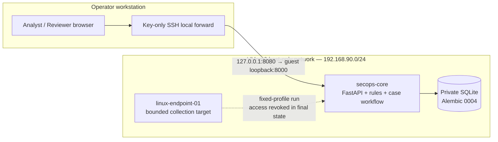
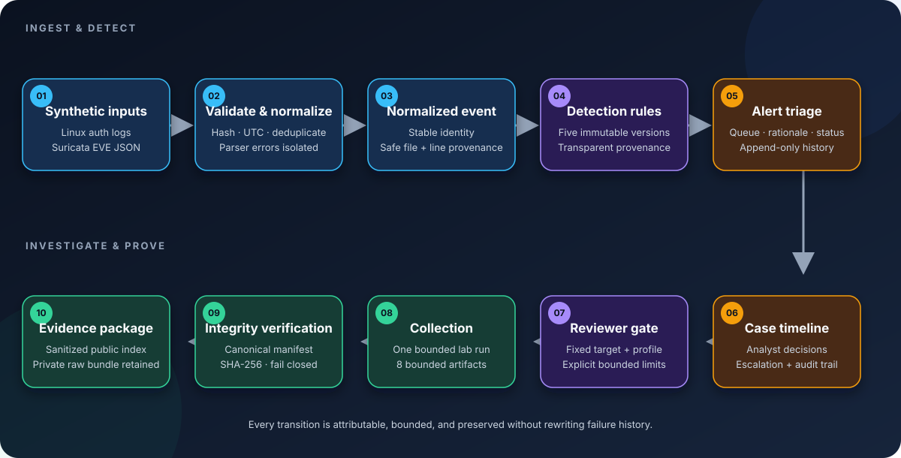
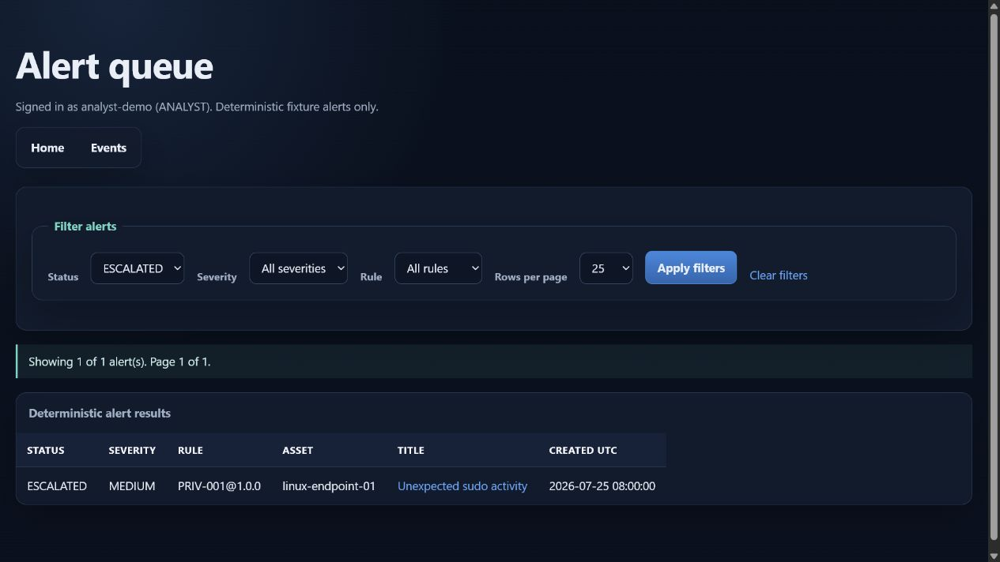
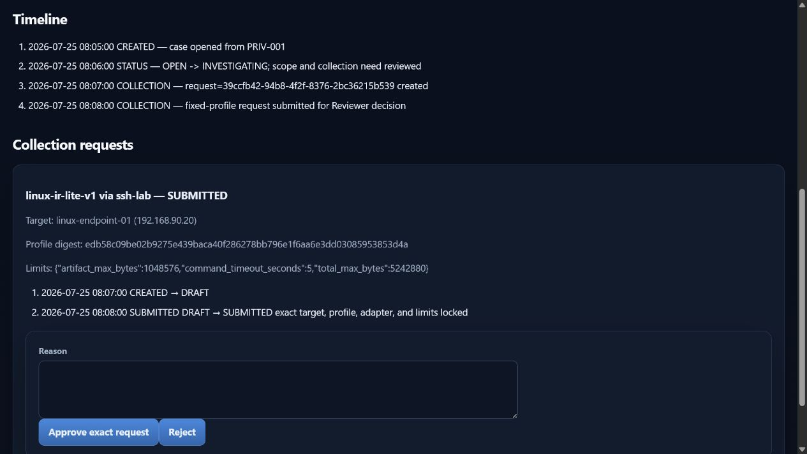
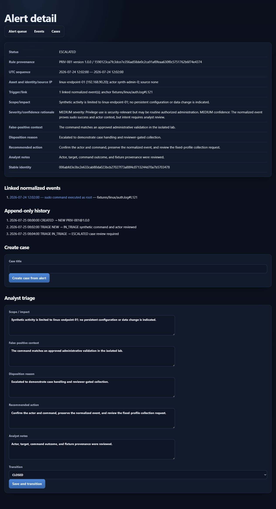

# Sagneo SecOps Workbench

[](https://github.com/Sagneo/sagneo-secops-workbench/actions/workflows/ci.yml)
[](https://github.com/Sagneo/sagneo-secops-workbench/releases/latest)
[](LICENSE)
[](LIMITATIONS.md)

A reproducible SecOps lab for following synthetic telemetry from bounded
intake through alert analysis, case handling, controlled evidence collection, and
integrity verification.

This is an isolated two-VM lab—not a production SIEM, enterprise incident
response platform, commercial SOC, or claim of professional supervision. Runtime
data and evidence stay private; the tracked fixtures and evidence reports are
synthetic or sanitized.

> [!IMPORTANT]
> **Lab boundary:** this repository demonstrates a reproducible synthetic
> SecOps workflow. It does not represent a production SOC, live customer data,
> professional supervision, or a publicly reachable security service.

## Learning context and practical focus

I built this project as part of my ongoing cybersecurity education and
independent home-lab practice. The goal was to move beyond isolated exercises and
implement a complete, reviewable defensive workflow: ingest telemetry, explain an
alert, manage an investigation, collect bounded evidence, verify integrity, and
prove that the result is reproducible.

The work emphasizes the habits I want to carry into security operations:
scope discipline, least privilege, explainable decisions, preservation of failure
history, measurable validation, and documentation that another analyst can follow.
Each claim below is tied to committed fixtures, tests, runbooks, or sanitized
evidence.

| Competency practiced | How it is applied here | Verifiable project evidence |
|---|---|---|
| Security architecture | Isolated two-VM home lab, host-only networking, loopback application exposure, key-only administration | [Architecture](#architecture), [Security](SECURITY.md) |
| Telemetry engineering | Bounded Linux authentication and Suricata ingestion, UTC normalization, provenance, parser-error isolation, replay deduplication | [Telemetry pipeline](docs/TELEMETRY_PIPELINE.md) |
| Detection engineering | Five versioned YAML rules, stable identities, deterministic evaluation, alert-event linkage | [Detection and triage](docs/DETECTION_AND_TRIAGE.md) |
| SOC analysis and triage | Alert filtering, severity/confidence rationale, false-positive context, disposition, recommended action, append-only history | [Alert triage report](docs/evidence/reports/02_ALERT_TRIAGE.md) |
| Incident workflow | Analyst and simulated Reviewer separation, case transitions, immutable collection requests, documented escalation and closure | [Incident report](docs/INCIDENT_REPORT.md) |
| Evidence handling | Fixed-profile collection, strict path/link/size controls, canonical manifests, SHA-256 verification, tamper tests | [Collection and integrity](docs/evidence/reports/04_COLLECTION_AND_INTEGRITY.md) |
| Secure engineering | Argon2, opaque sessions, CSRF, server-side authorization, CSP, bounded execution, hardened container settings | [Security](SECURITY.md), [Limitations](LIMITATIONS.md) |
| Validation and improvement | Automated tests, static analysis, dependency auditing, recovery checks, and a measured `666 → 1` identity-lookup improvement | [Process improvement](docs/PROCESS_IMPROVEMENT_CASE_STUDY.md), [Testing and recovery](docs/TESTING_AND_RECOVERY.md) |

The project also provided hands-on practice in diagnosing a failed collection,
correcting the narrow root cause without erasing the failure record, validating
recovery from disposable copies, and separating demonstrated lab capability from
production claims.

## Review in five minutes

- [Learning context and practical focus](#learning-context-and-practical-focus)
- [Architecture](#architecture) and [event-to-evidence workflow](#event-to-evidence-workflow)
- [Synthetic interface gallery](#synthetic-interface-gallery)
- [Verified results](#verified-results)
- [Five-minute reviewer tour](#five-minute-reviewer-tour)
- [Deterministic local demo](#deterministic-local-demo)
- [Security and isolation](#security-and-isolation)
- [Capabilities and deliberate exclusions](#capabilities-and-deliberate-exclusions)
- [Development overview](docs/DEVELOPMENT_OVERVIEW.md)
- [Limitations and status](#limitations-and-status)

## Architecture



The final lab state has one Custom `VMnet2` adapter per VM, no Bridged or NAT
adapter, no guest default route, and no public application listener. The collection
path shown above represents one bounded fixed-profile run; its dedicated account,
key, wrapper, and sudo entry are revoked in the final state.

## Event-to-evidence workflow

[](docs/assets/event-to-evidence-workflow.svg)

<sub>Open the diagram for a full-size view. Blue = ingestion, violet = detection
and review controls, amber = analyst workflow, green = collection and evidence.</sub>

Each supported transition is recorded through application behavior. The preserved
timeline includes the original technical collection failure and the corrected
replacement request; it does not rewrite failure history.

## Synthetic interface gallery

These views were rendered from a disposable fixture database. Accounts, events,
addresses, identifiers, dates, and decisions shown here are synthetic lab data;
no VM runtime, retained evidence, credentials, or operator information is present.
Select an image to inspect it at full size.

<table>
  <tr>
    <td width="50%"><a href="docs/assets/ui-alert-queue.jpg"></a></td>
    <td width="50%"><a href="docs/assets/ui-reviewer-collection.jpg"></a></td>
  </tr>
  <tr>
    <td><strong>Analyst queue.</strong> Deterministic filters expose rule, severity, asset, state, and UTC provenance.</td>
    <td><strong>Reviewer gate.</strong> The exact target, profile digest, adapter, limits, and immutable request history are visible before approval.</td>
  </tr>
</table>

<details>
<summary><strong>Analyst triage detail and append-only history</strong></summary>

[](docs/assets/ui-alert-triage.jpg)

</details>

## Verified results

| Area | Accepted result | Boundary |
|---|---:|---|
| Telemetry | 1,201 normalized events from 2 source types; 2 isolated parser errors | deterministic fixtures |
| Detection rules | 5 immutable versions | 4 telemetry rules + 1 evidence-integrity rule |
| Clean fixture evaluation | 665 alerts; replay creates 0 and reports 665 duplicates | disposable SQLite demo |
| Event-alert linkage | 1,555 links | exact tracked manifests |
| Rule distribution | `404 / 41 / 100 / 120`; `EVID-001 = 0` | clean clone has no private verification failure |
| Accepted collection | 8 artifacts, 61,910 bytes, verification PASS | one fixed lab target/profile; simulated review |
| Process improvement | SQL identity lookups `666 → 1` (99.85% reduction) | one synthetic SQLite workload |
| Final quality gate | 108 collected, 107 passed, 1 known Windows symlink skip, 0 failures/errors | clean local gate; 88% application line coverage |
| Final runtime | healthy on guest `127.0.0.1:8000`, reached through an SSH tunnel | private VMnet2-only lab |

The validated runtime contains 666 alerts because its preserved
verification record triggers `EVID-001`. The clean fixture demo correctly produces
665.

## Capabilities and deliberate exclusions

Implemented:

- Argon2 authentication, opaque server-side sessions, CSRF validation, and
  server-side Analyst/Reviewer authorization;
- SQLite with Alembic migrations through `0004`;
- bounded Linux authentication/sudo and Suricata EVE parsers;
- UTC normalization, stable SHA-256 identities, batch provenance, replay
  deduplication, parser-error isolation, and source health;
- transparent YAML detection rules, alert filters/pagination, append-only triage
  history, and case timelines;
- one Reviewer-gated `linux-ir-lite-v1` collection contract;
- bounded streaming collection and canonical manifest verification with strict
  path/link/size handling;
- deterministic offline fixture and disposable recovery procedures.

Deliberately excluded:

- live production sensors, arbitrary uploads, raw PCAP publication, or general
  remote command execution;
- SSO, registration, password reset, multi-tenant administration, or enterprise
  database engines;
- arbitrary forensic profiles, legal chain-of-custody claims, automated response,
  or production SLA claims;
- public runtime, Bridged networking, NAT in the final state, and public port
  publishing.

## Five-minute reviewer tour

1. Read the [source-health report](docs/evidence/reports/01_SOURCE_HEALTH.md)
   for intake boundaries, parser isolation, and freshness semantics.
2. Follow [alert triage](docs/evidence/reports/02_ALERT_TRIAGE.md) into the
   [case timeline](docs/evidence/reports/03_CASE_TIMELINE.md).
3. Inspect [collection and integrity](docs/evidence/reports/04_COLLECTION_AND_INTEGRITY.md)
   for the approval boundary, preserved failure, accepted replacement, and SHA-256
   limitations.
4. Compare the measured [process improvement](docs/evidence/reports/05_PROCESS_IMPROVEMENT.md).
5. Use the [evidence index](docs/evidence/EVIDENCE_INDEX.md), then
   review the three operational runbooks:
   [monitoring and triage](docs/runbooks/01_SOURCE_MONITORING_AND_TRIAGE.md),
   [case and evidence](docs/runbooks/02_INCIDENT_CASE_AND_EVIDENCE.md), and
   [demo and recovery](docs/runbooks/03_RECOVERY_DEMO_AND_ESCALATION.md).
6. Review the sanitized [incident report](docs/INCIDENT_REPORT.md), the compact
   release checklist in [CHANGELOG](CHANGELOG.md), and the
   [release integrity response procedure](docs/RELEASE_INTEGRITY_RESPONSE.md).

## Deterministic local demo

Prerequisites: Git, Python 3.12, and the locked dependencies. A cold dependency
install needs network access or a prepared wheel cache; after dependencies exist,
the fixture demo itself is offline.

```text
python -m venv .venv
python -m pip install --require-hashes -r requirements-dev.txt
python -c "from pathlib import Path; Path('data/disposable').mkdir(parents=True, exist_ok=True)"
```

Set a new disposable database before starting Python:

```powershell
$env:APP_DATABASE_URL = 'sqlite:///./data/disposable/reviewer-demo.db'
```

```bash
export APP_DATABASE_URL='sqlite:///./data/disposable/reviewer-demo.db'
```

Then run:

```text
alembic upgrade head
python -m app.telemetry seed-assets
python -m app.telemetry import --source LINUX_AUTH --path fixtures/linux/auth.log
python -m app.telemetry import --source SURICATA_EVE --path fixtures/suricata/eve.jsonl
python -m app.telemetry import --source LINUX_AUTH --path fixtures/linux/auth-malformed.log
python -m app.telemetry summary
python -m app.detections evaluate
python -m app.detections evaluate
python -m app.detections summary
```

Expected results are the clean-fixture values in the table above. Full commands,
failure handling, disposable SQLite restore, and private-evidence verification are
in [Testing, Offline Demo, and Recovery](docs/TESTING_AND_RECOVERY.md); the recorded
deterministic validation is in the
[Deterministic Fixture Demo Record](docs/DETERMINISTIC_DEMO_RECORD.md).

Account bootstrap is interactive:

```text
python -m app.bootstrap
```

It creates exactly one Analyst and one Reviewer and refuses to overwrite an existing
user set. Never place passwords, session values, private keys, accepted databases,
or raw evidence in commands, logs, screenshots, issues, or commits.

## Security and isolation

- Application port `8000` is published only on guest loopback and reviewed through
  a host loopback SSH tunnel.
- Lab administration is key-only SSH; root, password, and keyboard-interactive
  SSH are disabled.
- UFW denies unsolicited/lateral access; host administration is limited to
  `192.168.90.1`.
- The final configuration removes both development NAT adapters, automation sudo
  entries, and collector key/account access, wrapper, and sudo entry.
- The container runs nonroot with a read-only filesystem, no new privileges, and
  all capabilities dropped.
- Raw evidence, keys, runtime databases, VM files, installation media, private
  reports, caches, and operator-specific paths stay outside the tracked source tree.

See [Security](SECURITY.md) and [Limitations](LIMITATIONS.md).

## Technology stack

Python 3.12, FastAPI, Jinja2, SQLAlchemy, Alembic, SQLite, PyYAML, Argon2,
Docker Compose, pytest, Ruff, strict mypy, Bandit, Git, Ubuntu Server, VMware
Workstation, Linux auth/journal data, and Suricata EVE fixtures.

## Limitations and status

- Reviewer approval is a simulated lab control, not external professional supervision.
- Telemetry, users, assets, and workload are synthetic and lab-scale.
- SQLite is intentionally bounded to a single-instance lab.
- SHA-256 proves byte agreement with the trusted manifest, not original truth,
  completeness, or legal custody before hashing.
- The performance result does not generalize to concurrent, distributed, or
  enterprise workloads.
- Exactly six evidence reports exist; [report 6](docs/evidence/reports/06_REPRODUCIBILITY_CONTROLS.md)
  records reproducible CI and merge verification.
- Source distribution contains code and sanitized evidence only; it does not
  include or operate the private runtime.

Licensed under the [Apache License 2.0](LICENSE); see [NOTICE](NOTICE).
